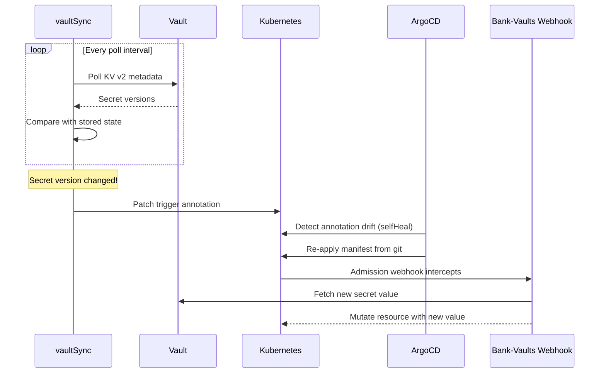
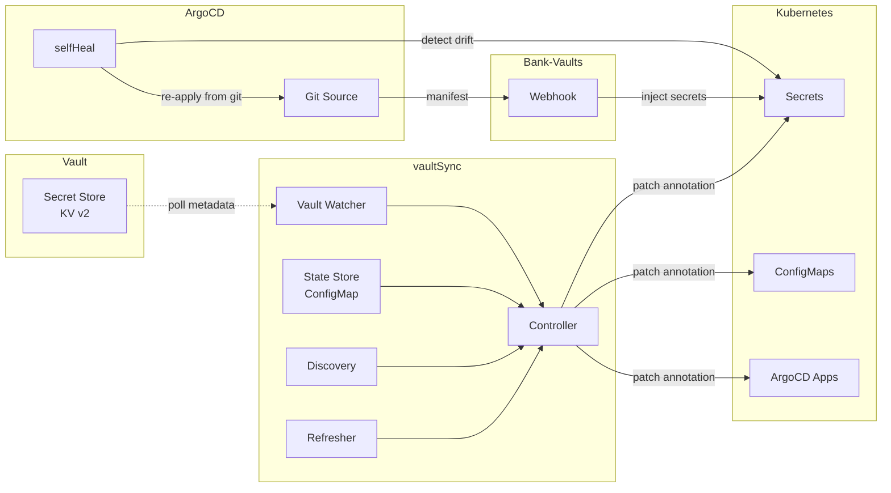

# vaultSync

[](https://go.dev/)
[](https://opensource.org/licenses/Apache-2.0)
[](https://github.com/thekoma/vaultsync/releases)
[](https://github.com/thekoma/vaultsync/actions/workflows/ci.yml)
[](https://goreportcard.com/report/github.com/thekoma/vaultsync)

Kubernetes controller that bridges HashiCorp Vault secret changes to ArgoCD-managed resources via annotation patching.

## The Problem

When using [Bank-Vaults](https://bank-vaults.dev/) webhook to inject secrets into Kubernetes resources, secret rotation in Vault does **not** automatically propagate to running workloads:

1. **Bank-Vaults webhook** only runs at admission time (pod creation). It does not watch for Vault secret version changes.
2. **ArgoCD `ignoreDifferences`** is typically set on injected fields (since the webhook mutates them), so ArgoCD never detects drift from the live secret values.
3. The result: secrets rotate in Vault, but workloads keep running with stale values until someone manually restarts them.

## How It Works

vaultSync polls Vault KV v2 metadata for version changes, then patches a `vaultsync/trigger` annotation onto resources that declared interest via a `vaultsync/watch` annotation. This causes ArgoCD's `selfHeal` to detect drift (the trigger annotation is not in git), re-apply the manifest, and the Bank-Vaults webhook re-injects the current secret value.

**This is entirely non-destructive** -- no pods are deleted, no secrets are overwritten. The annotation patch simply nudges ArgoCD to do its normal reconciliation.



## Architecture



### Components

| Component | Description |
|-----------|-------------|
| **Vault Watcher** | Authenticates to Vault via Kubernetes auth, lists KV v2 secret metadata and returns current versions |
| **State Store** | Persists the last-seen version per Vault path in a ConfigMap |
| **Discovery** | Scans Secrets, ConfigMaps, and ArgoCD Applications for the `vaultsync/watch` annotation |
| **Refresher** | Patches the `vaultsync/trigger` annotation on resources whose watched paths have new versions |
| **Controller** | Orchestrates a single reconciliation cycle: poll, diff, refresh |

## Quick Start

```bash
helm install vaultsync oci://ghcr.io/thekoma/charts/vaultsync \
  --namespace vaultsync --create-namespace \
  --set vault.addr=https://vault.vault.svc.cluster.local:8200
```

Or from source:

```bash
git clone https://github.com/thekoma/vaultsync.git
cd vaultsync
helm install vaultsync charts/vaultsync \
  --namespace vaultsync --create-namespace
```

## Vault Prerequisites

vaultSync authenticates to Vault via the [Kubernetes auth method](https://developer.hashicorp.com/vault/docs/auth/kubernetes). You need to configure three things in Vault before deploying:

### 1. Enable Kubernetes auth (if not already enabled)

```bash
vault auth enable kubernetes

vault write auth/kubernetes/config \
  kubernetes_host="https://kubernetes.default.svc:443"
```

### 2. Create a policy granting read access to secret metadata

vaultSync only reads **metadata** (version numbers), never the secret values themselves. However, Vault's KV v2 API requires the `read` capability on the metadata path and `list` for recursive discovery.

```bash
vault policy write vaultsync-policy - <<EOF
# List and read metadata for all secrets (no access to actual values)
path "secret/metadata/*" {
  capabilities = ["read", "list"]
}
EOF
```

> **Note:** If you want to use a broader existing policy (e.g., `allow_secrets` that grants full CRUD), that works too. vaultSync will never write to or read the actual secret data — only metadata.

### 3. Create a Kubernetes auth role for the vaultSync service account

```bash
vault write auth/kubernetes/role/vaultsync \
  bound_service_account_names=vaultsync \
  bound_service_account_namespaces=vaultsync \
  policies=vaultsync-policy \
  ttl=1h
```

The service account name and namespace must match the Helm release. With default values, both are `vaultsync`.

### Bank-Vaults operator

If you use the [Bank-Vaults operator](https://bank-vaults.dev/), add the role to your `Vault` CR's `externalConfig`:

```yaml
spec:
  externalConfig:
    policies:
      - name: vaultsync-policy
        rules: path "secret/metadata/*" {
          capabilities = ["read", "list"]
          }
    auth:
      - type: kubernetes
        roles:
          - name: vaultsync
            bound_service_account_names: ["vaultsync"]
            bound_service_account_namespaces: ["vaultsync"]
            policies: vaultsync-policy
            ttl: 1h
```

### Verify the setup

After deploying vaultSync, check the logs to confirm authentication:

```bash
kubectl logs -n vaultsync deployment/vaultsync | head -5
# Expected: "authenticated to vault"
```

If you see `invalid role name "vaultsync"`, the Vault role hasn't been created yet. If you see `permission denied`, check the policy bindings.

## Configuration

All configuration is via Helm values (which map to environment variables):

| Value | Env Var | Default | Description |
|-------|---------|---------|-------------|
| `vault.addr` | `VAULT_ADDR` | `https://vault.vault.svc.cluster.local:8200` | Vault server address |
| `vault.role` | `VAULT_ROLE` | `vaultsync` | Vault Kubernetes auth role |
| `vault.mount` | `VAULT_MOUNT` | `secret` | Vault KV v2 mount path |
| `vault.authMount` | `VAULT_AUTH_MOUNT` | `kubernetes` | Vault auth method mount path |
| `vault.skipVerify` | `VAULT_SKIP_VERIFY` | `false` | Skip TLS verification |
| `controller.pollInterval` | `POLL_INTERVAL` | `60s` | How often to poll Vault for changes |
| `controller.dryRun` | `DRY_RUN` | `false` | Log actions without patching resources |
| `controller.logLevel` | `LOG_LEVEL` | `info` | Log level: `debug`, `info`, `warn`, `error` |
| `state.namespace` | `STATE_NAMESPACE` | Release namespace | Namespace for the state ConfigMap |
| `state.configMap` | `STATE_CONFIGMAP` | `vaultsync-state` | Name of the state ConfigMap |
| `image.repository` | -- | `ghcr.io/thekoma/vaultsync` | Container image repository |
| `image.tag` | -- | `Chart.appVersion` | Container image tag |
| `serviceAccount.create` | -- | `true` | Create a ServiceAccount |
| `serviceAccount.name` | -- | Release fullname | ServiceAccount name override |
| `namespace.create` | -- | `true` | Create the namespace resource |

## Annotation Guide

### Opting a resource into vaultSync

Add the `vaultsync/watch` annotation to any Secret, ConfigMap, or ArgoCD Application:

```yaml
apiVersion: v1
kind: Secret
metadata:
  name: my-app-secret
  annotations:
    vaultsync/watch: "apps/my-app/config"
```

The annotation value is a comma-separated list of Vault KV v2 paths (relative to the configured mount):

```yaml
annotations:
  vaultsync/watch: "apps/my-app/config, apps/my-app/certs"
```

The `secret/data/` prefix is automatically stripped if present.

## How the Refresh Works

1. **Poll**: vaultSync calls Vault's `GET /v1/secret/metadata/:path` for every path discovered across annotated resources.
2. **Diff**: The current version from Vault metadata is compared against the version stored in the state ConfigMap. If they differ, the path is marked as changed.
3. **Patch**: For each resource watching a changed path, vaultSync sends a JSON merge-patch setting `metadata.annotations["vaultsync/trigger"]` to the current UTC timestamp.
4. **selfHeal**: ArgoCD detects the annotation as drift (it is not in the git manifest) and re-applies the resource from git, which removes the trigger annotation.
5. **Webhook**: During re-application, the Bank-Vaults admission webhook intercepts the resource and fetches the current secret values from Vault, injecting them into the resource.
6. **State update**: vaultSync persists the new version to the state ConfigMap so the same change is not processed again.

The net effect: secrets in Vault rotate, and within one poll interval, all annotated resources are refreshed with the new values -- without any pod restarts, manual intervention, or destructive operations.

## Development

```bash
# Run tests
make test

# Build binary
make build

# Build Docker image
make docker

# Package Helm chart
make helm-package
```

## License

[Apache License 2.0](LICENSE)
